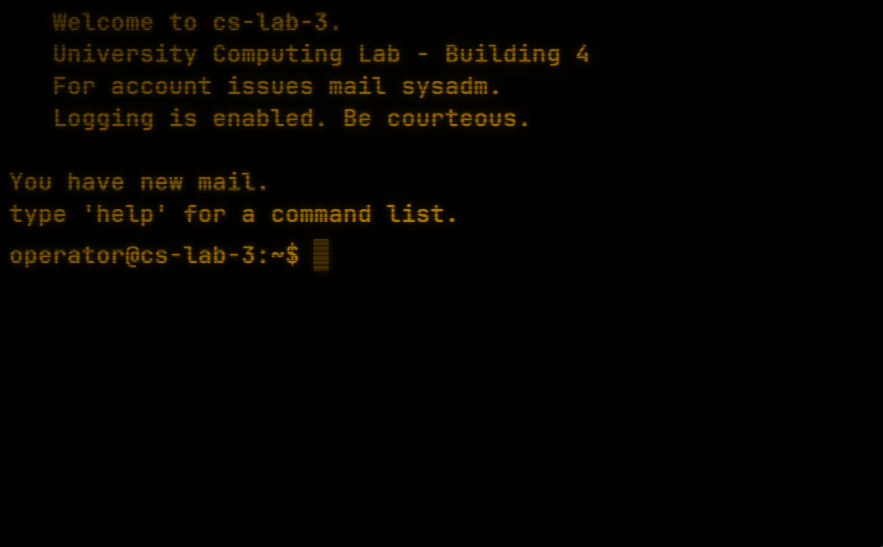

# cs-lab-3 — Episode 1



A small, free, browser-based UNIX investigation experience. The player is the
overnight `operator` on a fictional university system. Their morning mail
contains a quiet note from `sysadm` about a small accounting discrepancy.
They have an hour or so to figure out which account ran something it
shouldn't have, roughly when, and which log shows it cleanest — then file a
short report.

Period and tone are inspired by Clifford Stoll's *The Cuckoo's Egg*; the
names, host, numbers, and sequence of events are fictional and not a
recreation of any specific incident. MIT licensed (see [LICENSE](LICENSE)).

## Run locally

```sh
php -S localhost:8000 -t public
```

Then open http://localhost:8000 .

Requires PHP 8.1+ (for `match`, `str_starts_with`, `str_contains`,
constructor promotion). No frameworks, no Composer, no build step.

## Controls

- ↑ / ↓: command history
- Tab: autocomplete commands and paths
- Ctrl-L: clear the screen
- Alt-C: toggle CRT mode (scanlines, phosphor glow, vignette, flicker)

## Commands

Available commands:

`help`, `pwd`, `cd`, `ls` (`-l`), `cat`, `grep PAT FILE`, `who`, `last`,
`date`, `clear`, `report …`, `exit`. `help report` shows the report syntax.

## Win condition

```
report user=NAME time=HH:MM source=PATH
```

Tolerances:

- `user`: case-insensitive
- `time`: ±5 minutes (24-hour)
- `source`: full absolute path *or* the bare log filename

After three wrong reports, a single quiet hint is added to the rejection
message.

## Project structure

```
public/
  index.php       initial page (motd, prompt, htmx wiring)
  terminal.php    HTMX endpoint — one command per POST
  style.css       black background, amber monospace
  htmx.min.js     vendored, pinned 1.9.12
src/
  CommandRunner.php       command parser + dispatcher
  FakeFilesystem.php      in-memory read-only filesystem
  SessionState.php        thin $_SESSION wrapper
  ScenarioEpisode1.php    seed data + answer key
```

## Design notes

- **No real shell, ever.** User input never touches `system`, `exec`,
  `passthru`, `proc_open`, `popen`, `shell_exec`, or backticks. It also
  never reaches a real path operation: paths resolve only against the
  in-memory map in `FakeFilesystem`, and unknown keys return cleanly.
- **No randomness, no clocks.** The in-game date is fixed
  (`Tue Oct 13 06:47:23 1992`) so logs and `date` agree. Same input,
  same output.
- **Single responsibility.** Each `src/` file has one job. `CommandRunner`
  has no state of its own — it reads and writes through `SessionState`
  and reads through `FakeFilesystem`.
- **No premature abstraction.** There is no `Scenario` interface; Episode 2
  can copy `ScenarioEpisode1.php` and the entry points can switch on a
  single constant.

## Safety notes

This is a fake UNIX environment. Commands are parsed by the app and never
executed by the host system. User input does not reach a real shell or real
filesystem paths.

## What this game is not

- It is not a real shell. There is no I/O, no signals, no environment.
- It is not a tutorial. The player is expected to recognize what each
  log file is and to read carefully.
- It is not a re-creation of any specific historical incident. The
  numbers, names, hosts, and sequence of events are fiction.

## Scope

This is intentionally small and focused. Additional episodes may be added,
but the goal is to keep the experience tight and readable.
